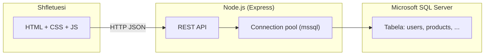
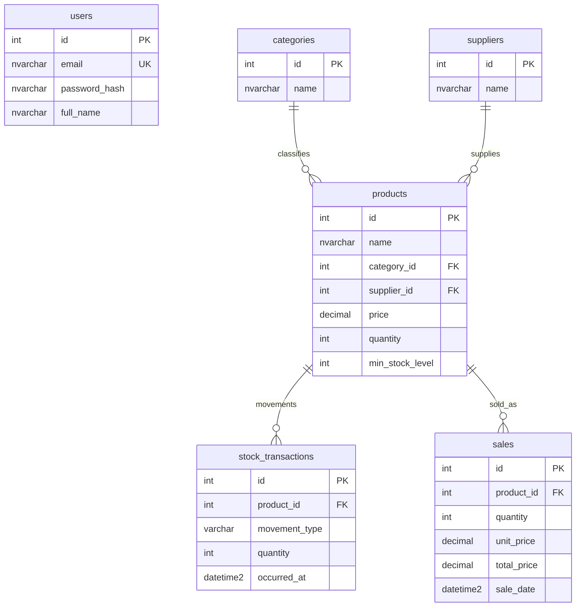

# Dokumentimi i projektit: Inventory Management System

Ky dokument përshkruan qëllimin e aplikacionit, strukturën e kodit, lidhjen me **Microsoft SQL Server** dhe mënyrën e ekzekutimit. Është menduar si referencë për zhvillim, dorëzim akademik ose mirëmbajtje.

---

## 1. Përmbledhje dhe qëllim

**Inventory Management System** është një aplikacion për menaxhim inventari: produkte, kategori, furnitorë, lëvizje stoku (hyrje/dalje), dhe shitje. Përdoruesit regjistrohen dhe hyjnë me email/fjalëkalim; të dhënat ruhen në një databazë relacionale (**SQL Server**), ndërsa përdoruesi përfundimtar punon përmes një **faqesh në shfletues** që komunikon me një **API REST** të ndërtuar në **Node.js**.

Schematicisht:



---

## 2. Teknologjitë kryesore

| Shtresa | Teknologji | Roli |
|--------|------------|------|
| Frontend | HTML5, CSS, JavaScript (pa framework) | Ndërfaqja e përdoruesit, `fetch` drejt API-së |
| Backend | Node.js, Express | Shërbime REST, logjika biznesi, lidhja me DB |
| Databaza | Microsoft SQL Server | Ruajtje e përhershme e të dhënave |
| Autentifikim | JWT (`jsonwebtoken`), bcrypt për fjalëkalimet | Token në `Authorization: Bearer ...` |

Paketa të rendësishme në backend (shih `backend/package.json`): `express`, `mssql`, `dotenv`, `cors`, `bcryptjs`, `jsonwebtoken`.

---

## 3. Struktura e projektit

```
Inventory Management System/
├── backend/
│   ├── server.js              # API Express + lidhja me SQL Server
│   ├── package.json
│   ├── .env                   # Konfigurimi lokal (mos e kopjo në git nëse ka sekrete)
│   ├── .env.example           # Shembull variablash mjedisi
│   ├── schema-sqlserver.sql   # Krijim databaze dhe tabela (ekzekuto në SSMS)
│   └── seed-sample-data.sql    # Të dhëna demo (opsionale)
├── frontend/
│   ├── index.html, dashboard.js    # Paneli kryesor
│   ├── auth.html, auth.js          # Hyrje / regjistrim
│   ├── products.html, products.js
│   ├── categories.html, categories.js
│   ├── stock.html, stock.js
│   ├── sales.html, sales.js
│   ├── reports.html, reports.js
│   ├── apiClient.js                # Klient REST + token në localStorage
│   ├── guard.js                    # Kontroll token për faqet e mbrojtura
│   └── styles.css
└── DOKUMENTIMI_PROJEKTIT.md        # Ky dokument
```

---

## 4. Si lidhet aplikacioni me databazën

### 4.1 Libraria dhe konfigurimi

Backend-i përdor paketën **`mssql`** për të hapur një **Connection Pool** drejt SQL Server. Konfigurimi lexohet nga variabla mjedisi (file `.env` në dosjen `backend`), për shembull:

- `SQLSERVER_SERVER` — adresa e serverit (p.sh. `localhost`)
- `SQLSERVER_PORT` — zakonisht `1433`
- `SQLSERVER_USER`, `SQLSERVER_PASSWORD` — kredencialet e përdoruesit të databazës
- `SQLSERVER_DATABASE` — emri i databazës, parazgjedhje `inventory_db`
- `SQLSERVER_ENCRYPT`, `SQLSERVER_TRUST_CERT` — për TLS në zhvillim lokal

Në kod (`server.js`), funksioni `sqlConfig()` përkthen këto vlera në një objekt konfigurimi për `mssql`, dhe `getPool()` krijon një **pool** të përbashkët (lidhje të ripërdorshme, më efikase se një lidhje e re për çdo kërkesë).

### 4.2 Rrjedha e një kërkese tipike

1. Përdoruesi hap një faqe që thirr `apiClient.getProducts()`.
2. `apiClient.js` dërgon `GET /api/products` me header `Authorization: Bearer <JWT>` (nëse ka token).
3. Express ekzekuton middleware-in `authMiddleware`, që verifikon JWT-n dhe (opsionalisht) ngarkon përdoruesin nga tabela `users`.
4. Handler-i i rrugës përdor `pool.request()` për të ekzekutuar SQL (p.sh. `SELECT ... FROM products`).
5. Rezultati kthehet si JSON për shfletuesin.

Kështu, **çdo operacion që prek të dhënat** kalon nga JavaScript në SQL përmes driver-it `mssql`, jo drejtpërdrejt nga shfletuesi në databazë — kjo është modeli i sigurt klasik **klient → API → databazë**.

### 4.3 Transaksione për integritet

Për veprime që duhet të jenë **atomike** (ose të gjitha sukses, ose asgjë), si regjistrimi i një lëvizjeje stoku ose një shitjeje, kodi përdor **`sql.Transaction`**: fillon transaksionin, lexon `products` me kyçje (`UPDLOCK`), përditëson stokun, fut rresht në `stock_transactions` ose `sales`, dhe **`commit`** ose **`rollback`** në rast gabimi.

---

## 5. Skema e databazës (SQL Server)

Databaza **`inventory_db`** (ose emri që vendosni në `.env`) përmban tabela të lidhura si më poshtë.

### 5.1 Përmbledhje e tabelave

| Tabela | Qëllimi |
|--------|---------|
| `users` | Përdoruesit e aplikacionit (email unik, `password_hash`, emër) |
| `categories` | Kategori produktesh |
| `suppliers` | Furnitorë |
| `products` | Produktet: çmim, sasi, lidhje me kategori dhe furnitor |
| `stock_transactions` | Histori hyrjesh/daljesh stoku (`IN` / `OUT`) për produkt |
| `sales` | Shitje: sasi, çmime, data |

### 5.2 Lidhjet (foreign keys)

- `products.category_id` → `categories.id` (në fshirje kategori, mund të bëhet `SET NULL` sipas skemës).
- `products.supplier_id` → `suppliers.id`.
- `stock_transactions.product_id` → `products.id` (`ON DELETE CASCADE`).
- `sales.product_id` → `products.id` (`ON DELETE CASCADE`).

### 5.3 Shembull vizual i marrëdhënieve



Skema e plotë dhe komandat `CREATE TABLE` gjenden në **`backend/schema-sqlserver.sql`**. Pas ekzekutimit në **SQL Server Management Studio (SSMS)** ose mjet të ngjashëm, databaza është gati për përdorim nga API-ja.

### 5.4 Të dhëna shembull

Skedari **`backend/seed-sample-data.sql`** shton kategori dhe produkte demo (mund të ekzekutohet shumë herë; shmang dublikimet sipas emrit). Skema fut edhe një furnitor parazgjedhje `Default supplier` nëse tabela është bosh.

---

## 6. API REST (përmbledhje)

Baza e URL-ve është zakonisht `http://localhost:3000` (ose `PORT` nga `.env`). Endpoint-et kryesore:

| Metoda | Rruga | Autentifikim | Përshkrim |
|--------|-------|--------------|-----------|
| POST | `/api/auth/register` | Jo | Regjistrim përdoruesi |
| POST | `/api/auth/login` | Jo | Hyrje, kthen JWT |
| GET | `/api/auth/me` | Po (Bearer) | Përdoruesi aktual |
| GET/POST/PATCH/DELETE | `/api/categories` | Po | CRUD kategorish |
| GET | `/api/suppliers` | Po | Lista furnitorësh |
| GET/POST | `/api/products` | Po | Lista / krijim produktesh |
| GET/POST | `/api/stock-transactions` | Po | Histori / lëvizje stoku |
| GET/POST | `/api/sales` | Po | Lista / regjistrim shitjeje |

Detajet e fushave dhe validimet janë në **`server.js`** për çdo rrugë.

---

## 7. Frontend dhe komunikimi me API-në

- **`apiClient.js`**: përmban funksione si `login`, `register`, `getProducts`, etj.; ruan JWT në `localStorage` (çelësi `ims_token`).
- Faqet e aplikacionit duhet të hapen në mënyrë që kërkesat `POST/GET` drejt `/api/...` të arrijnë serverin Express. Nëse hapni HTML nga një server statik tjetër (p.sh. port tjetër) ose `file://`, klienti mund të drejtojë automatikisht te `http://localhost:3000` sipas logjikës në `apiClient.js`.
- **`guard.js`**: në faqet ku përfshihet, nëse nuk ka token ose `/api/auth/me` dështon, përdoruesi ridrejtohet te `auth.html`.

---

## 8. Instalim dhe nisje

1. **SQL Server** i instaluar dhe i aksesueshëm; ekzekutoni **`schema-sqlserver.sql`** për të krijuar databazën dhe tabelat.
2. Në **`backend`**, kopjoni `.env.example` në `.env` dhe plotësoni fjalëkalimin e përdoruesit të DB-së, `JWT_SECRET`, etj.
3. Në terminal, nga dosja `backend`:
   ```bash
   npm install
   npm start
   ```
4. Hapni shfletuesin te **`http://localhost:3000`** dhe regjistrohuni ose hyni.

Nëse lidhja me SQL Server dështon, serveri nuk niset dhe shfaqet mesazh gabimi në konsolë — kontrolloni `.env`, që shërbimi SQL të jetë **running**, dhe që databaza **`inventory_db`** të ekzistojë.

---

## 9. Siguria (shënime të shkurtra)

- Fjalëkalimet ruhen si **hash** (bcrypt), jo tekst i thjeshtë (me përjashtim migrimit të vjetër që mund të përmirësohet në hash në hyrje të parë).
- JWT duhet të ketë **`JWT_SECRET` të fortë** në prodhim.
- Për prodhim, konsideroni HTTPS, rregulla firewall për SQL Server, dhe mos ekspozoni `.env`.

---

## 10. Përmbledhje

Projekti është një **sistem inventari me tre shtresa**: ndërfaqe web statike, API Node.js me **Express** dhe **mssql**, dhe **Microsoft SQL Server** për ruajtjen relacionale. Dokumenti **`schema-sqlserver.sql`** është burimi i së vërtetës për strukturën e databazës; **`server.js`** përmban të gjitha pyetjet SQL dhe rregullat e biznesit që lidhen me këtë skemë.

Për pyetje teknike ose zgjerime (raporte të reja, role përdoruesish, eksport Excel), referojuni kodit në `backend/server.js` dhe faqeve përkatëse në `frontend/`.
