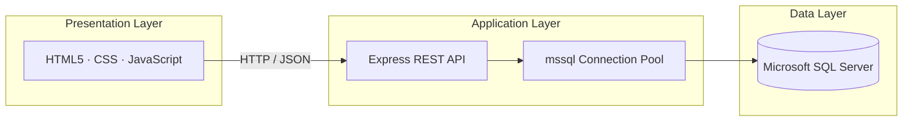
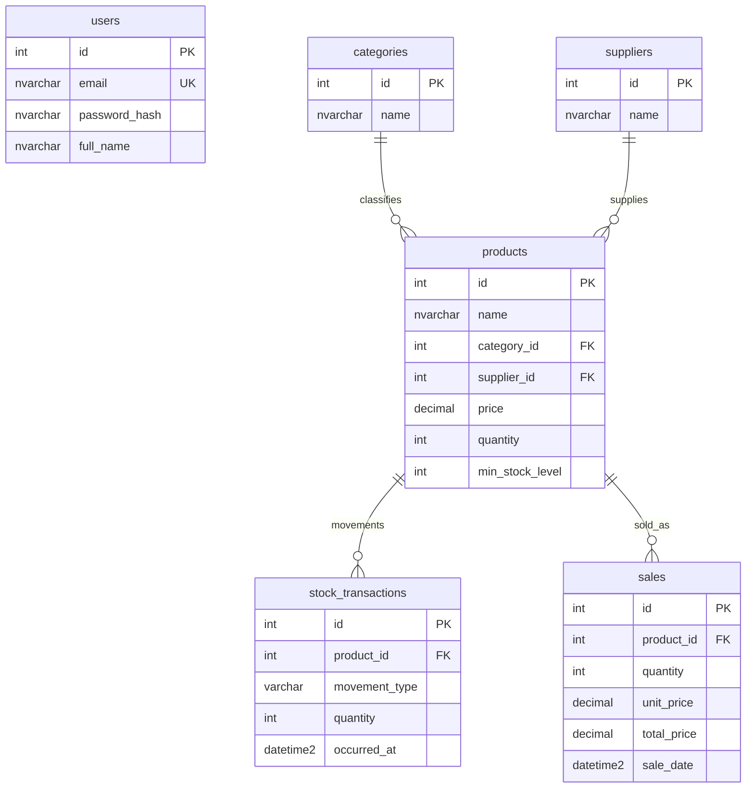

# Inventory Management System

A full-stack web application for managing product inventory, stock movements, and sales. The system follows a classic three-tier architecture: a browser-based client, a REST API built with Node.js and Express, and a relational data store on **Microsoft SQL Server**.

---

## Abstract

This project implements an operational inventory management workflow suitable for coursework, portfolio demonstration, or small-business prototyping. Authenticated users can maintain a product catalog organized by categories and suppliers, record stock inflows and outflows, register sales with transactional stock deduction, and view reporting dashboards. All persistent data resides in SQL Server; the client never connects to the database directly. Business rules and SQL access are centralized in the API layer, with **JWT-based authentication** and **bcrypt-hashed** credentials.

---

## Features

| Module | Capabilities |
|--------|----------------|
| **Authentication** | User registration, login, session token (`Bearer` JWT), protected routes |
| **Products** | CRUD operations, pricing, quantity on hand, minimum stock levels |
| **Categories** | Full CRUD for product classification |
| **Suppliers** | Supplier listing and product association |
| **Stock** | Stock movement history (`IN` / `OUT`) with atomic quantity updates |
| **Sales** | Sale registration with transactional inventory deduction |
| **Reports** | Dashboard summaries and inventory insights |

---

## Architecture

The application enforces a strict separation between presentation, application logic, and data persistence.



**Request lifecycle (typical read operation):**

1. The browser invokes `apiClient.js`, which attaches `Authorization: Bearer <token>` when available.
2. Express applies `authMiddleware` to protected routes, validating the JWT and loading the user from the `users` table.
3. Route handlers execute parameterized SQL via `pool.request()`.
4. Results are returned as JSON to the client.

Write operations that affect multiple tables (e.g. sales, stock movements) use **`sql.Transaction`** with row-level locking (`UPDLOCK`) to preserve inventory integrity.

---

## Technology Stack

| Layer | Technologies | Role |
|-------|--------------|------|
| **Frontend** | HTML5, CSS3, vanilla JavaScript | User interface; `fetch` API for REST communication |
| **Backend** | Node.js, Express | REST endpoints, business logic, database access |
| **Database** | Microsoft SQL Server | Relational storage (`inventory_db`) |
| **Security** | `jsonwebtoken`, `bcryptjs` | Token-based auth; password hashing |

**Key backend dependencies:** `express`, `mssql`, `dotenv`, `cors`, `bcryptjs`, `jsonwebtoken`

---

## Project Structure

```
Inventory Management System/
├── backend/
│   ├── server.js              # Express API and SQL Server integration
│   ├── package.json
│   ├── .env.example           # Environment variable template
│   ├── schema-sqlserver.sql   # Database and table definitions
│   └── seed-sample-data.sql   # Optional demo data
├── frontend/
│   ├── index.html             # Dashboard
│   ├── auth.html / auth.js    # Login and registration
│   ├── products.html / products.js
│   ├── categories.html / categories.js
│   ├── stock.html / stock.js
│   ├── sales.html / sales.js
│   ├── reports.html / reports.js
│   ├── apiClient.js           # REST client and token storage
│   ├── guard.js               # Route protection for authenticated pages
│   └── styles.css
└── README.md
```

---

## Database Schema

The canonical schema is defined in `backend/schema-sqlserver.sql`. Core entities and relationships:



| Table | Description |
|-------|-------------|
| `users` | Application accounts (unique email, hashed password) |
| `categories` | Product categories |
| `suppliers` | Vendor records |
| `products` | Catalog items linked to category and supplier |
| `stock_transactions` | Audit trail of stock `IN` / `OUT` movements |
| `sales` | Completed sales with pricing and timestamps |

---

## API Overview

Base URL (default): `http://localhost:3000`

| Method | Endpoint | Auth | Description |
|--------|----------|------|-------------|
| `POST` | `/api/auth/register` | No | Create account |
| `POST` | `/api/auth/login` | No | Authenticate; returns JWT |
| `GET` | `/api/auth/me` | Yes | Current user profile |
| `GET` / `POST` / `PATCH` / `DELETE` | `/api/categories` | Yes | Category CRUD |
| `GET` | `/api/suppliers` | Yes | List suppliers |
| `GET` / `POST` | `/api/products` | Yes | List or create products |
| `GET` / `POST` | `/api/stock-transactions` | Yes | Stock history and movements |
| `GET` / `POST` | `/api/sales` | Yes | Sales list and registration |

Protected routes require the header:

```http
Authorization: Bearer <your_jwt_token>
```

Implementation details, validation rules, and field contracts are documented in `backend/server.js`.

---

## Prerequisites

Before running the application, ensure the following are installed and configured:

- **Node.js** (v18 or later recommended)
- **npm** (included with Node.js)
- **Microsoft SQL Server** (local instance or accessible remote host)
- **SQL Server Management Studio (SSMS)** or equivalent tool to execute schema scripts

---

## Installation

### 1. Initialize the database

1. Open **SQL Server Management Studio** and connect to your instance.
2. Execute `backend/schema-sqlserver.sql` to create the database and tables.
3. *(Optional)* Run `backend/seed-sample-data.sql` to load demonstration categories and products.

### 2. Configure the backend

From the `backend` directory:

```bash
cp .env.example .env   # Windows: copy .env.example .env
```

Edit `.env` with your SQL Server credentials and a strong JWT secret:

| Variable | Description |
|----------|-------------|
| `PORT` | HTTP port for the API (default: `3000`) |
| `SQLSERVER_SERVER` | Server hostname (e.g. `localhost`) |
| `SQLSERVER_PORT` | SQL Server port (default: `1433`) |
| `SQLSERVER_USER` | Database login |
| `SQLSERVER_PASSWORD` | Database password |
| `SQLSERVER_DATABASE` | Database name (default: `inventory_db`) |
| `SQLSERVER_ENCRYPT` | Enable TLS (`true` / `false`) |
| `SQLSERVER_TRUST_CERT` | Trust self-signed certs in dev (`true` recommended locally) |
| `JWT_SECRET` | Secret key for signing tokens — **change in production** |

> **Security note:** Never commit `.env` to version control. Use `.env.example` as the reference template only.

### 3. Install dependencies and start the server

```bash
cd backend
npm install
npm start
```

The server verifies the SQL Server connection at startup. If the database is unreachable or misconfigured, startup fails with a console error — verify that SQL Server is running, credentials are correct, and `inventory_db` exists.

### 4. Access the application

Open a browser and navigate to:

```
http://localhost:3000
```

Register a new account or sign in. The Express server serves the frontend statically from the `frontend` directory.

---

## Frontend Integration

| File | Responsibility |
|------|----------------|
| `apiClient.js` | Centralized REST calls; stores JWT in `localStorage` (`ims_token`) |
| `guard.js` | Redirects unauthenticated users to `auth.html` on protected pages |

When the API runs on port `3000`, all pages should be accessed through that origin so `fetch` requests and static assets resolve correctly.

---

## Security Considerations

- Passwords are stored as **bcrypt hashes**, not plaintext.
- Use a long, randomly generated **`JWT_SECRET`** in any shared or production environment.
- Enable **HTTPS** and restrict SQL Server network exposure in production deployments.
- Keep `.env` out of public repositories; rotate credentials if accidentally exposed.

---

## License

This project is provided for educational and demonstration purposes. Specify a license (e.g. MIT) here if you intend to open-source the repository.

---

## Author

**Gresa Bruqi**

Developed as an academic inventory management system demonstrating REST API design, relational database modeling, and secure web client patterns.
